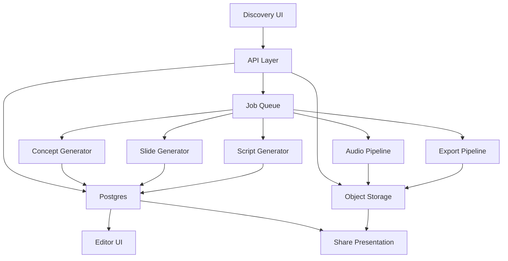

# Technische Codex-Roadmap – Pitchdeck-Tool

## 1. Ziel des Systems

Das Pitchdeck-Tool soll aus strukturierten Discovery-Daten und Dokumenten eines Kunden automatisch ein belastbares Beratungskonzept, ein präsentationsfähiges Pitchdeck, Sprechertexte, Audio-Payloads und eine scrollbare Web-Präsentation erzeugen.

Das System wird so aufgebaut, dass es zuerst intern für Beratungs- und Vertriebsgespräche nutzbar ist und später als verkaufbares SaaS-Modul erweitert werden kann.

---

## 2. Technisches Zielbild

### Kern-Workflow

1. Kunde und Discovery-Session anlegen
2. Gesprächsdaten, Dateien und Quellen erfassen
3. KI analysiert Pain Points, Ziele, Reifegrad und Chancen
4. System erzeugt ein strukturiertes Lösungskonzept
5. Konzept wird in ein Pitchdeck mit Folienlogik überführt
6. Für jede Folie werden Sprechertexte erzeugt
7. Audio-Payloads werden vorbereitet und an ElevenLabs übergeben
8. Präsentation wird als Web-Ansicht, PDF und interner Bearbeitungsmodus bereitgestellt

### Produktprinzipien

- modular
- versionierbar
- reviewbar vor Freigabe
- AI-first, aber mit menschlicher Korrekturschicht
- geeignet für parallele Codex-Tasks
- mandantenfähig vorbereitbar

---

## 3. Empfohlener Stack

### Frontend

- Next.js
- TypeScript
- Tailwind CSS
- komponentenbasierte Slide-Engine
- React Server Components dort, wo sinnvoll

### Backend

- Next.js API Routes oder separater Node.js-Service
- strukturierte Job-Queues für Langläufer-Prozesse
- Webhook-fähige Services für Audio- und Render-Pipelines

### Datenhaltung

- PostgreSQL oder Supabase Postgres
- Blob/Object Storage für Uploads, Bilder, Audio und Exporte
- Versionstabellen für Konzepte, Decks und Skripte

### AI-Layer

- OpenAI für Analyse, Strukturierung, Konzept und Slide-Generierung
- optionale Dokumentanalyse-Pipeline für PDFs, Webseiten und Angebotsunterlagen
- klar definierte JSON-Schemas für alle AI-Outputs

### Media

- Bildgenerierung über externen Bildworkflow
- ElevenLabs für Audio
- HTML-zu-PDF Rendering für Export

### Orchestrierung

- Codex für Implementierung, Refactoring, QA, UI-Arbeiten und Multi-Agent-Teilaufgaben
- separate Projektregeln via `AGENTS.md`
- wiederverwendbare Skills für definierte Engineering-Aufgaben

---

## 4. Repository-Struktur für Codex

```text
pitchdeck-tool/
  apps/
    web/
    worker/
  packages/
    ui/
    prompts/
    schemas/
    core/
    integrations/
  docs/
    architecture/
    product/
  infra/
    migrations/
    scripts/
  .codex/
    config.toml
  AGENTS.md
```

### Verantwortlichkeiten

- `apps/web`: Admin-Oberfläche, Editor, Pitchdeck-Ansicht, Share-Ansicht
- `apps/worker`: asynchrone Jobs für Analyse, Rendering, Audio, Exporte
- `packages/ui`: Slide-Komponenten, Designsystem, Formularbausteine
- `packages/prompts`: versionierte Prompt-Bausteine und Systemregeln
- `packages/schemas`: Zod- oder JSON-Schemas für AI-Outputs
- `packages/core`: Business-Logik, Use Cases, Transformationslogik
- `packages/integrations`: OpenAI, ElevenLabs, Dokumentanalyse, Mail, Storage
- `docs/architecture`: ADRs, Datenfluss, Betriebslogik

---

## 5. Codex-Setup im Projekt

### 5.1 Projektweite Regeln in `AGENTS.md`

In `AGENTS.md` sollte Codex projektweit angewiesen werden:

- immer zuerst bestehende Typen und Komponenten zu prüfen
- AI-Outputs nur gegen feste Schemas zu erzeugen
- keine unstrukturierten Freitext-Responses in Persistenzpfade zu schreiben
- Jobs idempotent zu bauen
- externe Integrationen kapseln
- jede neue Business-Funktion mit Tests oder Smoke-Checks zu liefern
- UI-Komponenten sauber von Orchestrierungslogik zu trennen

### 5.2 Skills für wiederkehrende Aufgaben

Empfohlene Skills:

- `discovery-form-builder`
- `ai-schema-enforcer`
- `concept-generator-builder`
- `slide-engine-builder`
- `presentation-ui-builder`
- `audio-pipeline-builder`
- `export-pdf-builder`
- `qa-regression-checker`

### 5.3 Arbeitsmodus mit Codex

Für dieses Projekt sollte Codex in klar getrennten Streams arbeiten:

- Architektur-Stream
- Frontend-Stream
- Backend-Stream
- Prompt-Stream
- Integrations-Stream
- QA-Stream

Jeder Stream bekommt klare Deliverables und arbeitet möglichst in isolierten Branches oder Worktrees.

---

## 6. Zielarchitektur



---

## 7. Datenmodell

### 7.1 Hauptentitäten

#### Client

- id
- companyName
- industry
- contactName
- contactRole
- website
- sizeBand
- createdAt
- updatedAt

#### DiscoverySession

- id
- clientId
- title
- sourceType
- rawNotes
- transcript
- currentStatus
- createdAt
- updatedAt

#### DiscoveryArtifact

- id
- discoverySessionId
- type
- storagePath
- mimeType
- extractedText
- metadata

#### PainPoint

- id
- discoverySessionId
- category
- severity
- description
- evidence

#### Need

- id
- discoverySessionId
- category
- priority
- description

#### ProcessSnapshot

- id
- discoverySessionId
- name
- actors
- currentFlow
- issues

#### SolutionConcept

- id
- discoverySessionId
- version
- summary
- challenges
- opportunities
- recommendations
- roadmap
- status

#### OfferModule

- id
- solutionConceptId
- name
- category
- description
- businessValue
- implementationComplexity

#### PitchDeck

- id
- solutionConceptId
- version
- title
- audience
- theme
- status

#### Slide

- id
- pitchDeckId
- orderIndex
- type
- title
- payloadJson
- notes

#### SlideScript

- id
- slideId
- version
- speakingMode
- text
- durationEstimate

#### AudioAsset

- id
- slideScriptId
- provider
- voiceId
- storagePath
- status

#### ExportAsset

- id
- pitchDeckId
- type
- storagePath
- status

### 7.2 Technische Regeln

- jede generierte Entität ist versioniert
- AI-Output wird nie direkt final veröffentlicht
- Freigabestatus trennt Rohentwurf und freigegebenen Stand
- Payloads in Slides bleiben strukturiert, nicht als HTML im Datensatz

---

## 8. API-Architektur

### Discovery

- `POST /api/clients`
- `GET /api/clients/:id`
- `POST /api/discovery-sessions`
- `PATCH /api/discovery-sessions/:id`
- `POST /api/discovery-sessions/:id/artifacts`

### Analyse

- `POST /api/discovery-sessions/:id/analyze`
- `GET /api/solution-concepts/:id`
- `PATCH /api/solution-concepts/:id`
- `POST /api/solution-concepts/:id/approve`

### Pitchdeck

- `POST /api/solution-concepts/:id/generate-deck`
- `GET /api/pitch-decks/:id`
- `PATCH /api/pitch-decks/:id`
- `PATCH /api/slides/:id`
- `POST /api/pitch-decks/:id/reorder-slides`

### Skript und Audio

- `POST /api/slides/:id/generate-script`
- `POST /api/pitch-decks/:id/generate-scripts`
- `POST /api/slide-scripts/:id/generate-audio`

### Export und Share

- `POST /api/pitch-decks/:id/export-pdf`
- `POST /api/pitch-decks/:id/publish`
- `GET /share/:publicToken`

### Architekturhinweise

- langlaufende Prozesse immer asynchron starten
- synchron nur Validierung und Job-Erstellung
- Polling oder WebSocket/Event-Stream für Statusupdates

---

## 9. Frontend-Architektur

### 9.1 Seitenstruktur

#### Interner Bereich

- Dashboard
- Clients
- Discovery Session Detail
- Solution Concept Review
- PitchDeck Editor
- Script Review
- Export Center

#### Externer Bereich

- Share-Landingpage
- Slide-by-slide Ansicht
- Scrollbare Langform
- PDF-Download

### 9.2 UI-Zonen im PitchDeck Editor

- linke Spalte: Struktur und Navigationsbaum
- mittlere Fläche: aktive Slide-Bearbeitung
- rechte Spalte: Live-Vorschau und Metadaten
- obere Leiste: Status, Version, Export, Freigabe

### 9.3 Komponenten

- `ClientForm`
- `DiscoverySectionCard`
- `ArtifactUploader`
- `PainPointMatrix`
- `ConceptReviewPanel`
- `DeckOutline`
- `SlideCanvas`
- `SlideInspector`
- `ScriptEditor`
- `AudioStatusBadge`
- `SharePreview`

---

## 10. Slide-System

### 10.1 Slide-Typen im MVP

- TitleSlide
- ExecutiveSummarySlide
- ProblemClusterSlide
- TargetStateSlide
- SolutionModuleSlide
- WorkflowSlide
- RoadmapSlide
- InvestmentSlide
- NextStepsSlide

### 10.2 Technischer Aufbau

Jeder Slide-Typ bekommt:

- eindeutigen Typnamen
- valides Schema
- Renderer-Komponente
- Bearbeitungsmaske
- optionale PDF-Render-Strategie
- optionale Sprechertext-Regeln

### 10.3 Beispiel für Payload-Logik

```text
Slide.type = 'problem_cluster'
Slide.payloadJson = {
  headline,
  intro,
  clusters: [
    { title, pain, impact, consequence }
  ]
}
```

---

## 11. AI-Orchestrierung

### 11.1 Pipeline

1. Rohdaten normalisieren
2. Discovery zusammenfassen
3. Pain Points clustern
4. Needs priorisieren
5. Zielbild formulieren
6. Lösungsmodule vorschlagen
7. Pitch-Narrativ aufbauen
8. Folienstruktur ableiten
9. Sprechertexte erzeugen

### 11.2 Output-Regeln

- jede Stufe liefert streng validierbares JSON
- jeder Schritt speichert Input, Output und Prompt-Version
- Retry-Strategien nur bei validierbaren Fehlern
- unvollständige Outputs werden verworfen oder in Review verschoben

### 11.3 Guardrails

- Schema-Validation
- Maximal-Längen für Textfelder
- Pflichtfelder für Pitchdeck-Erstellung
- Qualitätschecks für doppelte oder widersprüchliche Inhalte

---

## 12. Audio-Pipeline

### Schritte

1. freigegebenen `SlideScript` laden
2. Audio-Request-Payload erzeugen
3. ElevenLabs-Request senden
4. Audio-Datei speichern
5. Status aktualisieren
6. Zuordnung in Präsentation herstellen

### Technische Anforderungen

- provider-agnostische Audio-Schnittstelle
- idempotente Job-IDs
- Wiederanlauf bei temporären Fehlern
- getrennte Stimmeinstellungen pro Deck oder Kunde

---

## 13. Export- und Share-System

### Exportformate

- PDF
- HTML Share View
- interne Präsentationsansicht

### Share-Anforderungen

- öffentliche Token-URL oder passwortgeschützter Zugriff
- responsives Layout
- Audio je Abschnitt optional automatisch oder manuell startbar
- Trackingschnittstelle für Aufrufe optional später

### Rendering-Regeln

- Slides dürfen nicht nur für Editor optimiert sein
- Share-Ansicht und PDF müssen aus derselben strukturierten Quelle erzeugt werden

---

## 14. Sicherheit und Compliance

### Grundregeln

- keine Secrets im Frontend
- Uploads über signierte URLs oder kontrollierte API-Flows
- Dateien serverseitig validieren
- Trennung interner und öffentlicher Assets
- PII sparsam speichern
- Audit-Log für Freigaben und Exporte

### Rollen im späteren SaaS-Ausbau

- Owner
- Consultant
- Editor
- Viewer
- External Client Viewer

---

## 15. Testing-Strategie

### Unit Tests

- Schema-Validatoren
- Payload-Mapper
- Generierungs-Use-Cases
- Slide-Transformationslogik

### Integration Tests

- Discovery zu Concept
- Concept zu PitchDeck
- Slide zu Script
- Script zu Audio-Job

### E2E Tests

- Client anlegen
- Discovery ausfüllen
- Konzept erzeugen
- Pitchdeck generieren
- Slide bearbeiten
- Share-Ansicht öffnen

### Smoke Checks

- Build
- Typecheck
- zentrale Render-Pfade
- Export-Job-Test mit kleinem Fixture

---

## 16. Observability

### Logs

- Job gestartet
- Job erfolgreich
- Job fehlgeschlagen
- externe API-Fehler
- Validierungsfehler

### Metriken

- Konzept-Generierungsdauer
- Pitchdeck-Generierungsdauer
- Audio-Fehlerrate
- Export-Dauer
- Share-Aufrufe

### Tracing

- idealerweise korrelierte IDs über Discovery, Konzept, Deck, Skript und Audio

---

## 17. Delivery-Plan für Codex

### Phase A – Foundations

#### Ziele

- Monorepo aufsetzen
- Basis-Apps und Packages anlegen
- Datenbankmodell definieren
- `AGENTS.md` und erste Skills festlegen

#### Codex-Tasks

- Repo-Scaffold generieren
- TypeScript-, Lint- und Test-Setup
- Basisschemas und DB-Modelle erzeugen
- API-Ordnerstruktur anlegen

#### Exit-Kriterien

- App bootet
- Datenbank migrierbar
- Grundkonfiguration für Codex steht

---

### Phase B – Discovery MVP

#### Ziele

- Client- und Discovery-Verwaltung
- Uploads und Rohnotizen
- Reviewbare Datenerfassung

#### Codex-Tasks

- Formulare und Listen bauen
- CRUD-Endpunkte implementieren
- Dateiupload integrieren
- Validierung und Statusmodell ergänzen

#### Exit-Kriterien

- Discovery kann vollständig erfasst werden
- Testdaten können gespeichert und erneut geladen werden

---

### Phase C – Konzeptgenerator MVP

#### Ziele

- KI-Analyse mit strukturiertem Output
- Review-Oberfläche für Konzept

#### Codex-Tasks

- Prompt-Module und Schemas bauen
- Use Case `generateSolutionConcept` implementieren
- UI für Review und Korrektur entwickeln
- Jobverarbeitung und Fehlermanagement ergänzen

#### Exit-Kriterien

- aus einer Discovery-Session wird ein versioniertes Konzept erzeugt
- Konzept ist editierbar und freigabefähig

---

### Phase D – PitchDeck MVP

#### Ziele

- automatische Folienstruktur
- Editor und Live-Vorschau

#### Codex-Tasks

- `PitchDeck`, `Slide`, Renderer und Editor bauen
- Slide-Schemas und Komponenten implementieren
- Reihenfolge- und Duplizierlogik ergänzen

#### Exit-Kriterien

- aus einem Konzept entsteht ein Deck
- Slides sind editierbar und renderbar

---

### Phase E – Scripts und Audio

#### Ziele

- Sprechertexte pro Folie
- Audio-Pipeline vorbereiten

#### Codex-Tasks

- `SlideScript`-Generierung
- UI für Review und Tonalität
- Audio-Provider-Interface und Joblogik

#### Exit-Kriterien

- jede freigegebene Folie kann ein Skript erhalten
- Audio-Job kann ausgelöst und gespeichert werden

---

### Phase F – Share-Experience

#### Ziele

- scrollbare Kundenpräsentation
- PDF-Export

#### Codex-Tasks

- Share-Route und Public Token Flow
- responsive Story-Ansicht
- PDF-Export-Job
- optionale Audio-Steuerung

#### Exit-Kriterien

- Deck ist extern lesbar und exportierbar

---

### Phase G – Produktisierung

#### Ziele

- Multi-Tenant-Vorbereitung
- Rollenmodell
- Vorlagen und White-Label-Basis

#### Codex-Tasks

- Organisationsmodell
- Zugriffskontrolle
- thematisierbare Decks
- Usage- und Billing-Vorbereitung

#### Exit-Kriterien

- System ist intern stabil und für SaaS-Ausbau vorbereitet

---

## 18. Sprint-Empfehlung

### Sprint 1

- Repo-Setup
- DB-Modell
- Discovery CRUD
- Grundlayout

### Sprint 2

- Uploads
- Analyse-Pipeline
- Konzept-Review

### Sprint 3

- Deck-Generierung
- Slide-Renderer
- Editor

### Sprint 4

- Skript-Generator
- Audio-Queue
- Share View

### Sprint 5

- PDF-Export
- QA
- Härtung
- erste Template-Varianten

---

## 19. Definition of Done für das MVP

Das MVP ist fertig, wenn:

- ein Kunde angelegt werden kann
- eine Discovery-Session mit Dateien erfasst werden kann
- daraus ein strukturiertes Konzept generiert wird
- daraus ein Pitchdeck mit mehreren Slide-Typen erzeugt wird
- Sprechertexte pro Slide erstellt werden können
- eine scrollbare Share-Ansicht verfügbar ist
- ein PDF-Export erzeugt werden kann
- zentrale Flows automatisiert getestet oder als Smoke-Test abgesichert sind

---

## 20. Erste Codex-Aufträge

### Auftrag 1

Erstelle das Monorepo für das Pitchdeck-Tool mit Next.js, TypeScript, Tailwind, Worker-App, gemeinsam genutzten Packages und Test-Setup.

### Auftrag 2

Definiere das Datenmodell für Client, DiscoverySession, SolutionConcept, PitchDeck, Slide, SlideScript und ExportAsset inklusive Migrationsstrategie.

### Auftrag 3

Baue das Discovery-Modul mit Formularen, Uploads, Validierung und API-Endpunkten.

### Auftrag 4

Implementiere eine AI-Pipeline, die aus einer Discovery-Session ein validiertes `SolutionConcept` als JSON erzeugt.

### Auftrag 5

Baue eine Slide-Engine mit mindestens 5 Slide-Typen, Editor, Live-Vorschau und versionierbarer Deck-Struktur.

### Auftrag 6

Implementiere Script-Generierung und eine provider-agnostische Audio-Pipeline.

### Auftrag 7

Baue die Share-Ansicht und PDF-Export-Pipeline.

---

## 21. Empfohlene Reihenfolge für dich

Für deinen praktischen Start:

1. Foundations
2. Discovery
3. Konzeptgenerator
4. PitchDeck-Engine
5. Share-Ansicht
6. Audio
7. SaaS-Härtung

So entsteht zuerst der geschäftlich wichtigste Kern:

**Discovery → Konzept → Pitch → Versandbare Web-Präsentation**
